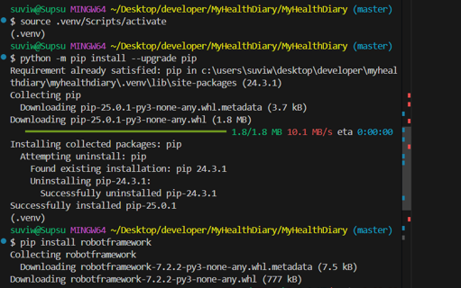
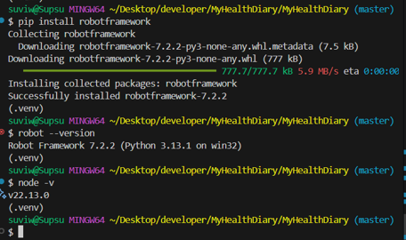
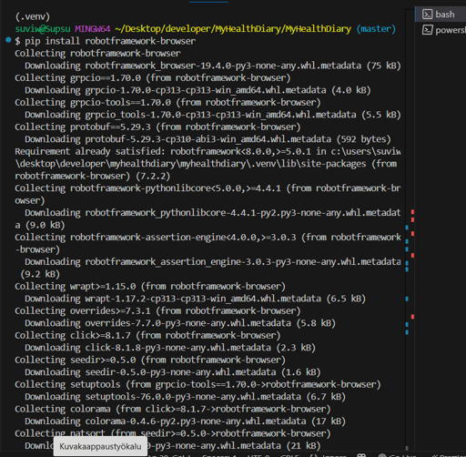
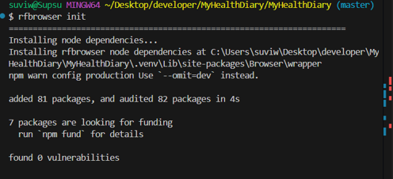
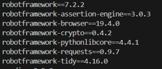
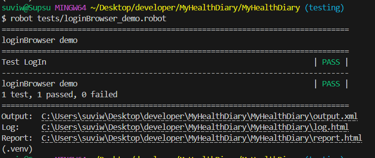
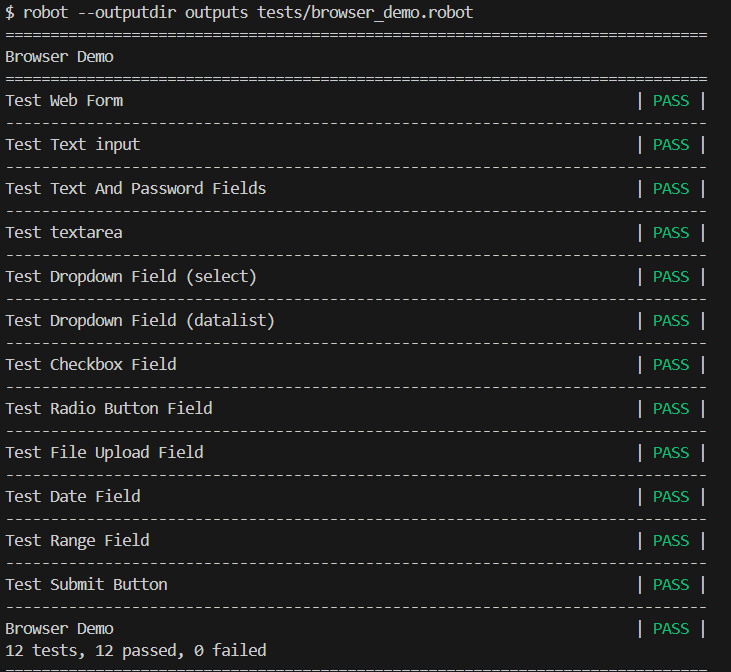
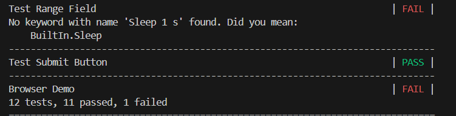
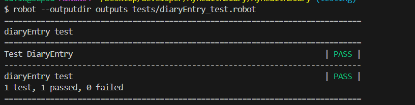

# Ohjelmistotestaus - yksilötehtävät Suvi Westerberg
# Projekti - Terveyssovelluksen kehitys

## **Tehtävä 1**

Tehtävä 1 dokumentoi vaiheittaiset ohjeet Robot Frameworkin ja siihen liittyvien kirjastojen asennuksen Visual Studio code ympäristössä

### Avaa oma projektisi ja luo testaus kansiot tulevia testejä varten
1. Avaa Visual Studio Code. Avaa oma **frontend** projektisi (File > Open Folder). Lisää projektin juuren uusi kansio (new folder) `tests` ja sen alle kaksi kansiota `front` ja `back`.

Näitä kansioita käytetään myöhemmin testailuun.

### Testaa ensin että Python asennus on kunnossa.
1. Avaa terminaali, ja sieltä valitse Git Bash. 
2. Anna terminaalissa komento
```sh
python --version
```
terminaalissa tuloksen pitäisi näyttää esim. tältä:
```
Python 3.13.1
```

## Seuraavaksi luodaan virtuaaliympäristö
1. Seuraavaksi ajetaan komento
```sh
python -m venv .venv
```
Tämä luo projektiisi uuden kansion .venv

2. Seuraavaksi  aktivoidaan virtuaaliympäristö antamalla komento (jos windows)
 ```sh
  source .venv/Scripts/activate
  ```
Kun virtuaaliympäristö on aktivoitu, terminaalin prompt muuttuu ja työskentelet nyt virtuaaliympäristössä. Seuraavassa on kuva tästä ja seuraavista toiminnoista jotka teemme nyt.
### Virtuaaliympäristön aktivointi


Ennenkuin jatketaan lisätään tämä .venv tiedosto gitignoreen. Jos projektissasi ei ole jo `.gitignore` tiedostoa, sellainen kannattaa luoda. Lisätään sinne .venv
Nyt virtuaaliympäristön tiedostot eivät kopioidu Github-kansioon.

## Seuraavaksi teemme kuvassakin näkyvät toiminnot
1. Ensin tarkistetaan, että Python-pakettien asentaja (pip) on päivitetty. Anna terminaalissa komento
```sh
 python -m pip install --upgrade pip
 ```
## Kun python ja pip asennettu ja päivitetty asenneteen robot Framework
1. Ajetaan komento
```sh
pip install robotframework
```
ja testaa myös, että asennus on onnistunut
```sh
robot --version
```

2. Asenna Browser libraryt
Varmista, että **Node.js** on asennettu:
```sh
node -v
```
Asenna Browser Library ja selainajurit:
```sh
pip install robotframework-browser
```
Alusta kirjaston toiminta
```sh
rfbrowser init
```

### Robotframeworkin asennuksen tarkistus 







## Jatketaan asennuksia.
### Request libraryn asennus
```sh
pip install robotframework-requests
```

### Cryptolibraryn asennus
```sh
pip install robotframework-cryptolibrary
```

### Robotidyn asennus
```sh
pip install robotframework-tidy
```

## Asennuslistan tarkistus
`pip freeze` on komento joka listaa kaikki nykyisessä Python ympäristössä asennetut paketit ja niiden versiot. Antamalla komennon
```sh
pip freeze
```
Tarkista että listastasi löytyy ainakin seuraavat (**HUOM! versionumerot voi olla eri**)



### Voit myös ohjata pip freeze- komennon luottelon tiedostoon käyttämällä uudelleen ohjausta. Tämä luo `requirements.txt` tiedoston, joka sisältää kaikki nykyisessä ympäristössä asennetut paketit ja niiden versiot.
```sh
pip freeze > requirements.txt
```
Tämän tiedoston avulla voit asentaa samat paketit toisessa ympäristössä käyttämällä seuraavaa komentoa
```sh
pip install -r requirements.txt
```

Tässä asennettiin Robot Framework, jonka avulla voisaan tehdä ohjelmistojen automaattista testausta. Lisäksi asennettiin tarvittavat työkalut testausta varten. 
Ensimmäiseksi varmistettiin, että Python on asennettu, jonka jälkeen luotiin erillinen virtuaaliympäristö.
Lopuksi tarkistettiin, että kaikki asennukset onnistuivat ja tallennettiin tiedät `requirements.txt`-tiedostoon. 
Tässä asennuksessa siis tehtiin perusasetukset ohjelmistojen automaattista testausta varten, jotta voidaan testata sovelluksen toimivuutta eri tavoin.


[Siirry Tehtävään 2](#tehtava-2)
## Tehtävä 2
Sovelletaan annettua esimerkkiä kirjautumis testistä omalle terveyspäiväkirja-sovellukselle.
Luodaan automaatiotesti, joka testaa omaan web-sovellukseeni sisäänkirjautumisen toimivuutta.

## Mitä testi tekee?

Testi tekee seuraavat toiminnot:
1. Avaa web-sovellukseni osoitteessa `http://localhost:5173/`
2. Klikkaa painiketta "Kirjaudu / Rekisteröidy", jolloin avautuu modaalilomake
3. Täyttää käyttäjätunnuksen ja salasanan automaattisesti
4. Klikkaa "Kirjaudu sisään" -painiketta
5. Tarkistaa, että kirjautuminen onnistuu (esimerkiksi "Omat Sivut" -linkki ilmestyy näkyviin)

## Testin rakenne

Testi on kirjoitettu `loginBrowser_demo.robot`-tiedostoon. Alla esimerkki testikoodista:

```robot
*** Settings ***
Library     Browser    auto_closing_level=KEEP
Resource    loginKeywords.robot  

*** Test Cases ***
Test LogIn
    New Browser    chromium    headless=No  
    New Page       http://localhost:5173/
    Click With Options    css=a.openModal    delay=2 s

    Get Title      ==    HyteGym sivusto
    Type Text      id=username        ${Username}    delay=0.1 s 
    Type Secret    id=password        ${Password}    delay=0.1 s
    Click With Options    id=btn-login    delay=2 s
```
**Tämä testi ajetaan komennolla:** `robot tests/loginBrowser_demo.robot
`
## Tunnukset

Testissä käytetään seuraavia tunnuksia käyttäjän kirjautumistietojen tallentamiseen. Näihin syötetään sellaiset tunnukset, joilla kirjautuminen onnistuu web-sovellukseen. Nämä tiedot tallennetaan esimerkiksi `loginKeywords.robot` kansioon, jota `loginBrowser_demo.robot` kuuntelee koodia ajaessaan

```robot
*** Variables ***
${Username}     tähän toimiva käyttäjätunnus 
${Password}     tähän toimiva salasana
```

### Testikansiot ja tiedostot
- `tests/` on kansio, jossa kaikki testit sijaitsevat
- `loginBrowser_demo.robot` sisältää itse testin
- `loginKeywords.robot` voi sisältää tunnuksia ja avainsanoja

## Esimerkkikuva onnistuneesta testistä.
Kun testi onnistuu niin tulee **PASS**, alla kuva onnituneen testin tuloksesta:


## Tulostiedostojen hallinta

Testiajon jälkeen Robot Framework ja Browser-kirjasto luovat useita loki- ja tulostiedostoja, kuten:

- `output.xml`
- `log.html`
- `report.html`
- `playwright-log-...`

Nämä tiedostot voivat muuten jäädä projektin juureen ja tehdä kansiosta epäsiistin.

**Ratkaisu:** voit ohjata kaikki nämä tiedostot omaan siistiin kansioon, esim. `outputs/`. Lisää `outputs` kansio projektin juureen. Jos teit testit ennen kansion luomista, voit raahata yllä olevat tiedostot sinne. Jatkossa testien tulokset menevät outpust-kansioon ja koodi pysyy siistimpänä. Käyttämällä seuraavaa komentoa, saat **`outputs`** kansion käyttöön:

```bash
robot --outputdir outputs tests/loginBrowser_demo.robot
```

## Tehtävä 3 – Web form -sivun kenttien testaus

### Tehtävänanto

Tutki lisää Browser Libraryn käyttöä. Tee testi, joka testaa Web form -esimerkkisivun muiden kenttien toimintaa  
([https://www.selenium.dev/selenium/web/web-form.html](https://www.selenium.dev/selenium/web/web-form.html)).  
Testissä tulee käsitellä mahdollisimman monta lomakekenttää, kuten:

- Dropdown (select)
- Dropdown (datalist)
- File input
- Checkboxit
- Radiobuttonit
- jne.

---

Testattavia lomakekenttiä tällä sivulla ainakin 12. Alla listattuna kaikki testattavat kohdat:

1. **Tekstikenttä** (`my-text`)
2. **Salasanakenttä** (`my-password`)
3. **Tekstialue** (`my-textarea`)
4. **Dropdown (select)** (`my-select`)
5. **Datalist (autocomplete)** (`my-datalist`)
6. **Checkbox** (`my-check`)
7. **Radio buttonit** (`my-radio`)
8. **File input** (`my-file`)
9. **Color picker** (`my-colors`) tätä en saanut toimimaan
10. **Date input** (`my-date`)
11. **Range slider** (`my-range`)
12. **Submit button** (`button`)

---

Näiden perusteella rakennetaan testit, joissa täytetään ja valitaan lomakekentät selaimessa käyttäen Robot Frameworkin Browser-kirjastoa.

Tässä on esimerkkikoodeja, joilla voit testata Web Form -sivun eri kenttiä.
Nämä koodit ajetaan
```bash
robot --outputdir outputs tests/browser_demo.robot
```

```robot
*** Settings ***
Library     Browser    auto_closing_level=KEEP
Resource    Keywords.robot  

*** Test Cases ***
Test Web Form
    New Browser    chromium    headless=No  
    New Page       https://www.selenium.dev/selenium/web/web-form.html 
    Get Title      ==    Web form  
    Type Text      [name="my-text"]        ${Username}    
    Type Secret    [name="my-password"]    $Password      
    Type Text      [name="my-textarea"]    ${Message}     
    Click With Options    button    delay=2 s
    Get Text       id=message    ==    Received!


Test Text input
    New Browser    chromium    headless=No  
    New Page       https://www.selenium.dev/selenium/web/web-form.html 
    Get Title      ==    Web form 
    Type Text      [name="my-text"]    ${Username}    delay=0.1 s


Test Text And Password Fields
    New Browser    chromium    headless=No
    New Page       https://www.selenium.dev/selenium/web/web-form.html
    Get Title      ==    Web form

    # Tekstikenttä
    Type Text      [name="my-text"]        ${Username}    delay=0.1 s

    # Salasanakenttä
    Type Secret    [name="my-password"]    $Password    delay=0.1 s


Test textarea  
    New Browser    chromium    headless=No
    New Page       https://www.selenium.dev/selenium/web/web-form.html
    Get Title      ==    Web form

    Type Text      [name="my-textarea"]     ${Message}      delay=0.2s

Test Dropdown Field (select)
    New Browser    chromium    headless=No
    New Page       https://www.selenium.dev/selenium/web/web-form.html
    Get Title      ==    Web form

    Select Options By    [name="my-select"]    value    2   delay=0.3s

Test Dropdown Field (datalist)
    New Browser    chromium    headless=No
    New Page       https://www.selenium.dev/selenium/web/web-form.html
    Get Title      ==    Web form

    Type Text    [name="my-datalist"]   Seattle  delay=0.2s

Test Checkbox Field
    New Browser    chromium    headless=No
    New Page       https://www.selenium.dev/selenium/web/web-form.html
    Get Title      ==    Web form

    Check Checkbox    id=my-check-2   
    Sleep       1   s   

Test Radio Button Field
    New Browser    chromium    headless=No
    New Page       https://www.selenium.dev/selenium/web/web-form.html
    Get Title      ==    Web form

    Click    id=my-radio-2
    Sleep    1 s 

Test File Upload Field
    New Browser    chromium    headless=No
    New Page       https://www.selenium.dev/selenium/web/web-form.html
    Get Title      ==    Web form

    Click    [name="my-file"]
    Sleep    1 s

#Värin testaaminen ei ole toistaiseksi onnistunut
#Test Color Picker Field
    #New Browser    chromium    headless=No
    #New Page       https://www.selenium.dev/selenium/web/web-form.html
    #Get Title      ==    Web form

    #Execute JavaScript    document.getElementsByName('my-colors')[0].value = '#F014D3'

    #Type color    [name="my-colors"]    #F014D3

Test Date Field
    New Browser    chromium    headless=No
    New Page       https://www.selenium.dev/selenium/web/web-form.html
    Get Title      ==    Web form

    Type Text    [name="my-date"]    2025-03-25    delay=0.2 s  

Test Range Field
    New Browser    chromium    headless=No
    New Page       https://www.selenium.dev/selenium/web/web-form.html
    Get Title      ==    Web form

    Fill Text    [name="my-range"]    10


Test Submit Button
    New Browser    chromium    headless=No
    New Page       https://www.selenium.dev/selenium/web/web-form.html
    Get Title      ==    Web form

    Click    text=Submit
    Get Text    id=message    ==    Received!

```

Kun testi on mennyt onnistuneesti läpi niin consoliin tulostuu jokaisen kohdalla **PASS**


ja jos jokin testionnistuu, niin siitäkin tulee ilmoitus ja siinä lukee myös mitä ongelma koskee, jolloin sitä on helpompi yrittää korjata ja muokata



## Tehtävä 4 – Päiväkirjamerkinnän automatisoitu testaus


Testi sisältää seuraavat vaiheet:
1. Sovelluksen avaaminen ja kirjautuminen
2. Siirtyminen päiväkirjasivulle
3. Uuden päiväkirjamerkinnän täyttäminen lomakkeelle
4. Lomakkeen lähettäminen
5. Merkintöjen hakeminen näkyville

Testissä käytettiin `delay`-parametria ja `Sleep`-komentoja hidastamaan toimintaa, jotta testin kulku olisi selkeästi nähtävissä käyttöliittymässä.

### Testikoodi
Testikoodi on ajettu
```bash
robot --outputdir outputs tests/diaryEntry_test.robot
```

```robot
*** Settings ***
Library     Browser    auto_closing_level=KEEP
Resource    loginKeywords.robot  

*** Test Cases ***
Test DiaryEntry
    New Browser    chromium    headless=No  
    New Page       http://localhost:5173/
    Click With Options    css=a.openModal    delay=2s

    Get Title      ==    HyteGym sivusto   

    Type Text      id=username        ${Username}    delay=0.1 s 
    Type Secret    id=password        $Password      delay=0.1 s
    Click With Options    id=btn-login    delay=2 s
    
    Click With Options    css=.add-diary    delay=2s

    # Täytä lomake
    Type Text    id=entry-date      03-25-2025    delay=0.5s
    Type Text    id=mood            hyvä          delay=0.5s
    Click        label[for="mood4"]
    Sleep        1s
    Type Text    id=weight          54            delay=0.5s
    Type Text    id=sleep-hours     6             delay=0.5s
    Type Text    id=water-intake    2000          delay=0.5s
    Type Text    id=steps           5000          delay=0.5s
    Type Text    id=notes           Robot testien tekemistä    delay=0.3s

    # Lähetä merkintä
    Click        id=save-entry
    Sleep        2s

    # Näytä kaikki merkinnät
    Click        css=.fetch-entries
    Sleep        2s
```
ja lopuksi kun testi on onnistunut tulee **PASS** merkintä:
  


